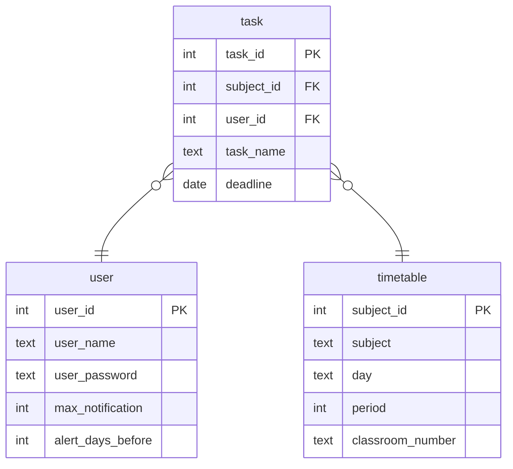

```mermaid
erDiagram

%% PK:Primary Key(主キー)
%% FK:Foreign Key(外部キー)

task }o--|| user: ""
task }o--|| timetable: ""

%% 会員テーブル
user {
  int user_id PK
  text user_name
  text user_password
  int max_notification
  int alert_days_before
}

%% 時間割テーブル
timetable {
  int subject_id PK
  text subject
  text day
  int period
  text classroom_number
}

%% 課題テーブル
task {
  int task_id PK
  int subject_id FK
  int user_id FK
  text task_name
  date deadline
}
```

### 会員テーブル(user)
ユーザーID(PK)、ユーザー名、ユーザーPW、最大通知数、締め切り日に対して何日前に警告を出すか

### 時間割テーブル(timetable)
科目ID(PK)、科目名、曜日、時限、教室番号

### 課題テーブル(task)
課題ID(PK)、科目ID(FK)、ユーザーID(FK)、課題名、締め切り日
